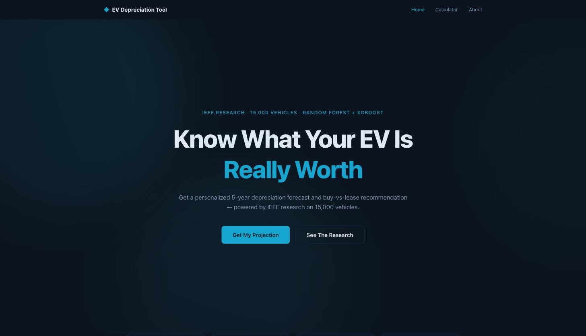
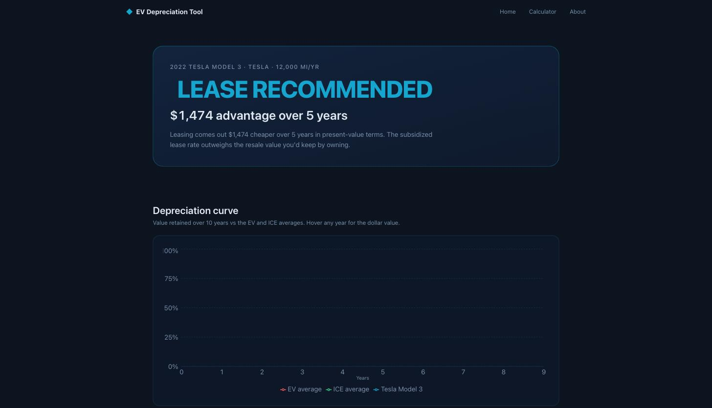
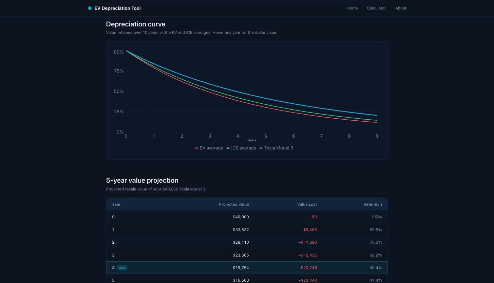

<div align="center">

# ⚡ EV Depreciation Tool

**Personalized 5-year depreciation forecasts and a buy-vs-lease NPV recommendation for electric vehicles — powered by IEEE research on 15,000 vehicles.**

[](https://ev-depreciation-tool.vercel.app)

[**🚀 Live Demo**](https://ev-depreciation-tool.vercel.app) · [**Calculator**](https://ev-depreciation-tool.vercel.app/estimate) · [**The Research**](https://ev-depreciation-tool.vercel.app/about)

</div>

---

## Overview

Electric vehicles lose value on a different curve than gas cars — and that gap changes the math on whether you should **buy or lease**. EV Depreciation Tool turns an IEEE research paper into an interactive projection: enter your vehicle, and it models a 10-year depreciation curve, estimates 5-year resale value, and returns a clear buy-vs-lease recommendation with the dollar advantage spelled out.

## Screenshots

<div align="center">

### Landing


### Recommendation


### Depreciation dashboard


</div>

## The research behind it

The projection logic is grounded in an IEEE paper that analyzed **15,000 vehicles** using **Random Forest** and **XGBoost** models (best model **R² = 0.990**). Headline findings baked into the tool:

| Finding | Value |
| --- | --- |
| EVs depreciate faster than ICE | **~3.6 pp/yr** |
| 5-year value retention — EV | **30.3%** |
| 5-year value retention — ICE | **33.9%** |
| 5-year value retention — Tesla | **41.4%** |
| Budget EVs (&lt;$35k) | **17.9%** |
| Luxury EVs (&gt;$50k) | **35.6%** |
| Top depreciation drivers | Vehicle Age **40.3%** · Model Year **35.4%** · MSRP **21%** |

Buy vs lease is compared as a **5-year net present value** at a **7% discount rate**, using EV/ICE lease rates (1.2% / 1.5% of MSRP per month), maintenance ($500 / $1,200 per year), and energy costs ($0.04 / $0.12 per mile). All figures live in [`src/data/constants.js`](src/data/constants.js) as a single source of truth, and the engine is validated against the paper's published deltas (`npm run validate`).

## Tech stack

- **Framework:** React 19 + Vite
- **Styling:** Tailwind CSS v4 (custom navy/teal design tokens)
- **Charts:** Recharts · **Animation:** Framer Motion · **Routing:** React Router
- **HTTP:** axios
- **Deploy:** Vercel (SPA rewrites for client-side routing)

## Project structure

```
src/
  components/   NavBar + landing/ + results/ UI building blocks
  pages/        Landing · InputForm (/estimate) · Results (/results) · About
  hooks/        useProjection — memoized projection state
  utils/        projections.js (the engine) + formatting helpers
  data/         constants.js (research SOT) + vehicles.js (catalog)
scripts/
  validate.mjs  asserts the engine reproduces the paper's figures
```

## Getting started

```bash
npm install
npm run dev       # local dev server
npm run build     # production build → dist/
npm run validate  # check the engine against the paper's figures
```

## Credits

Built by **Ved Shrinivas**, American School of Dubai · IEEE Research 2025 · Mentor: **Vinay Vishwakarma**
